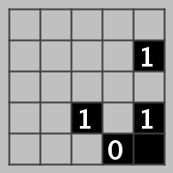

# SAT Encoding Challenge for the CONVIDE Lecture

This is a challenge for the [CONVIDE](https://www.sfb1608.kit.edu/) [Formal Specification and Analysis](https://formal.kastel.kit.edu/teaching/convide-formal/) lecture.

# The Puzzle Light Up

The logic puzzle "Light Up" is an NP-complete thinking task that we want to solve in this practical assignment using a propositional logic SAT (satisfiability) solver.

## Task Description

The goal in Light Up is to place lamps on a square game board in such a way that all squares are illuminated, but two lamps do not illuminate each other. There are walls (blocks) placed on the game board that restrict the range of the lamps. Additionally, walls can be given a boundary condition specifying how many lamps must be placed in their surrounding area. Formally described:

### Specification

Given a chessboard-like game board of size N. The squares of the board are initially either empty or occupied by a wall. Walls are either unmarked or marked with a number between 0 and 4.

Place lamps on the empty squares such that the following conditions hold:

- For every initially empty square, there is a lamp that is either in the same row or column, without a wall between the square and the lamp.
- There are no two lamps that are in the same row or column without a wall between them.
- Each wall marked with a number z is adjacent to exactly z squares occupied by lamps.

Two squares are considered adjacent if they are next to each other either horizontally or vertically (but not diagonally).

### Example



The figure shows an example of a game board of size N = 5. Next to the initial situation (a), there is a situation with a placed lamp (b), as well as a lamp placement that fulfills all conditions from the specification.

### References

- [Simon Tatham's Puzzles: LightUp](https://www.chiark.greenend.org.uk/~sgtatham/puzzles/js/lightup.html)

## Your job

Implement the class `Solver` for which you find the skeleton in the sources. The class `Example` shows how the SAT solver can be addressed.

To run your solution, you can invoke
```
./gradlew run --args=5:i1g1a1c0B
```
to get the above example.

### Some more example to solve:

```
5:i1g1a1c0B
```
All contraints 0-4 appear in:
```
7:BBb3aBaBiBBi1a2c0c4aBg
```

```
10:b10cB1bBj3a2c1Ba2bBa1hBa22bBBa0h0aBbBa0BcBaBjBb21cBBb
```

```
10:b10cB1bBj3a2c1Ba2bBa1hBa22bBBa0h0aBbBa0BcBaBjBb21cB0b
```

```
45:b1cBBBBBb0b0BBBBa2BaBbBBbBcBa2a1e2fB2gBa2Be2bBB0cBBbB0bB1BBaBBb2bBeBBbBBBBBaBaBa1aBa3Ba1d1cBa0bBdBB0aBB1a2bBBa1g2a3aBaBaBbBB2f1BBbBbBeBBaBaBBcBBBaBBb2iBaBBBBfB1dBBBBBaB0BBaBaBcBbBcBa0BBBaBa3bBBa1bBaB1a1bBBBB2aBd2aBbBaBcBa1BBbBBBaBBc0aBbBaBdBB1d3aB3cBbBBcBa1gBbB1aBBBB2dBaBcB2d1eBcBaBBcBaBBBBaBBcBBa3bBBaBBaBBeBaBB2BBBbBbBc1c1aBbBdBaBe1b2a2B1g3a2aBa2aBaBBBaBeBbBa1cBd3aBbBbB0cB1aBBBBaBBBaB0bBBaBBaBBaBcBBdBaBBeBBBBBBBBBa1cBB2gBBBBBbB1a2a1aBcB1a2bBa1bBbBBBBBBBbBa1aBaBcBB1BbBc1cBaBd2bB1bBe1dB2c1BcBBaBaBBBaBiBb1b2dBaB2bBaBaBb1BbBa1bBBBB1aBeBBBbBBa1B2bBbBBBBBBbBeBBBa1B1d0a1BBaBBBBbBBBcBBBc3eB1BaBaBcBbBbBBd2cBBaBBB2c1BBb1BBBaBB1aBBaBBaBBBBBbBBBBaB1BBBBaBBb1c1BbBBa2bBBeBBbBBBbBeBBaBdBBdBBaBBBBBaBaBa2aBBaB1a1c0d1d1b0aBbBBBBaBBbBaBBBbBBbBBBaBbBBc0d0dBa1aB1bB12cBa12bB2bBBaB1a2b3bB0gBBBBBcBb1BaBbBBa0fBbBaBa3BbBBBBBa1aBb1gBBc0bBa0aBBaBbBdBiBBBB2bBa201dBBBc0aBa3cBc1d0aBBBbBcBBcBaBaBBBaBcB2cBBbBBBbB2eB3cBaBBBBaBaB2BBBBBBb1bBBBbB2aBc1aBBBc2cBBbBBBgBcBaBBBbBBcBcBB1dBa1BBBBf1cBBB1BBaBBBBaBc1dBd1BeBBBb3hB1BaBaBc2BBBBBBa21cBaB0a1dBbBkBiBb2dBBaBBBBBBmBcBa2aBB0BBBBaBbB2aBaBb2BBBB2b1bBBBaB1Ba3aBbBiBeBBaBcBeBbBa2aBaBbB1dBBbBBBBbBBBBaBBBBBB2cBBBdBa1aBb1eBBbBBB1bBBbBaBBBa2aBbBBBa0aBa2BBBaBbB0aBBB10BbBa1aBB3bBBbBBBa2aBaBaBBdB1cBBBBBgBBaBc1eB0aBB1cBaBBaBBb1BBe3cB1aBb2aBaB0aB0cBb0aBB3bBaB1bBBa1a3Ba2eBBBaBBBcBBBbBaBb0gBaB0bBBaBaBBBc2aBaBBBd2aBBBBdBaBbBb1d0c1bBa3bBBa1bBbBBBaBaBBb1bBa3a2cBBBbBBBfBBBBaBBBa0bBBBa1a
```

```
45:a1bBaBBaBc1aBbB1aBBBBBbBaB0cBc2aBBaBaBb1aBaBaBa2fBaB0e0BBk1b2BBa2b3BaBdBBaBBaB1eBB1bBb1cBbBcBbBbBf0B2aBaBaBaBbBaBBbBdBaBa2a1BBaBBaBB1b10bBBaBBBBa4a2BaBb1aBB1BBBBa1BeBbBB1b0aBa2c0d2aBa1d2a3aBaBcBfBBBeBdBBa0b0eBaBa2a2bBdBbBcBaBaBd1a0dBcBeBaBa1c2a0dBa0BBBaBc1cBBbBBbBBB2b2cBaBaBBe2b2cB1a1dBaBaBBBB2aBaBcB0cBeBBaBeBaBBBa0aBbBbBbBd1cBeBeBa30cBBBaBaBBa0BBc3aBb0eBb2b1Bb22BBeBaBb1cBBa2cBBeBaBh0dBb2aBBaB0BcBaBB0bBBaBaB0bBBaBbBaBcBbBcB2a1c3bBaBbBbBaBaB2a3iB2bBa1g1eB2bBbBB1bBaBeBBaBfBcBBdBBdBaBBfBdBb3BBaBgBaBhBaBBBd4aB1aBBBbBBBaBd3BBBbBBBc11bB1BBBbBaBaBBBd4aBbBa3aBg1B0BaBcBc2dBBaBbBbBbBa2a3cBBBBcBh1a2bBBaBa0B2b1cBBBBbBBg2BbBb1BaBBcBBBaBeBBBBaBaBbBa1b20dBB2Ba22aBBBaBB1eBBdBaBd1BeBhBBeBBBBBBcB1BBa2b3aBBhBBB2eBaBBB0a2cBB0dBBbBBbBb1cBcBe1dBgBbBBaBBaBbBBBbBBBaBBBBaBBBc1aBbBBBeBdBBa3b2d1fBa3BBaB00Ba1a2j0Ba2bBbBc0BB2bBBBBd1BBaBbBc1BBaBcBBBcBeBaBa12a3bBBaBhB12c0aBBBB0aBBc1BBBbBbBBaBbBaBb1c00aBb1a0cBdBaBcBB1BcBB3aB2cBcBbBbBe0f13b0aBeB1BcBf2fBcBbBBaBbBdBb0b1d0b1aB0gBaBbBBc1a1dBeBBfBbBBBB1aBj1aBBBBcBe1BB1c1a01BaBgBbBcBBBBBbBbBaBa2b1eBBd1dBB1B1a100aBBB1BB1b2BbB1fBBBBBcBb1aBb0eBBBc2aBBbB0aBBBc21bBBBcBBaBBaBBbBBBBcBeBbBcBB0aBbBa0b1d1BBa2aBe3bBd1aBbBbBf1a1eBeBBeBBBBBc0Bc3aBb3aBaBaBhBa0a0a2a1aBeB10bBeBBaBBBa3d0BdBB0aBcBBB0aBB0cBaBcBBf2bBcBBaBaBa1fBBBBBBBB1cBa1a0b2d1cBB1c1aBBBa0bBBb1b1aBc1Be3aBB0dBBBBBbBaB1b
```

```
70:a0Ba1bBbBBdBBBBBeBBBaBaBaBa02bBb11bBBBeBaBaBBaBaBb1aBdBBaB2c3bBBaBBb2BBBcBaBaBBcBgBaBBb3aBaBBbBBBh1a2BaBBBaBBaBBaBBj11cBc4aBBbBaBBBBBbBBBd4aBb0b0BdB2aBb2BaBaBa2aBgB11dBBaBb0b11aBa1cB1cBcB1cBa0dBBaBaBcBBeBaBBB11BBc1a1h1a0e3d1BBaBBbB1aBa2a3bBBBaBBB2e1cBBdBbBaBBBa100aBBd1BcBaBBcBBdBBaBbBa00B0b0eBaBBa1bBBbBb3bBfBcBcBa2BB1cBBBb2aBB1eBBB1Bb1BdBaBaBbB0cBBBa3e1BcBbBBBBbB2bBB1dBBBBBBBBBfBbB1bBBbBaB1bBcBa2hBB1B1dBbBf1cBaBbBB1b1BBBBaBbBf2bBbBBaBaBBBlBa2BaBaBBaBB1eBBb4aBcBa1BBBBB1fB1aBaBaB1b1aBaBcBc2aBBBaBa4bBbBdBBBcBaBa2eBdB2aBbBbBc4aBdBhBj0aBBa3a2bBaBa2bBeBaBBa3aBaBB1bBbBBBbBBaBaBBa3aBBa3d1eBcBBaBBBBB2aBBBBBa1aBBa2bBc1bBdBBaBBB2aBB2cBBb4cBBBBaBBBbBBBBcBaBb1dBaBaBaB2b2BBBBBcBB1bBaBbBBBBdBbBBB0c0BBBa3BdB2bBaB0c1aBBBaBBaBgB3dBBcBdBa0bBa2gBaBBb1bBBBaBBBfBa2bBaBc0a2BBBBbBBB1c2a2b2bBaBBaBeBBb0BBc0BaBc11aBb1BbBBaBaBeBa2aBbBbBBaBBBBaBaBaBBBBaBc3aBeBbBB3aBdBa0aBBBbBaBBaBBBaBbBBBaBBd2BaBBcBBBbBBc2aBBBBBa3bBcBaBaBBBb1a1bBBbBBBBaBBBaBd1dBBc1aBaBBbBBb1aB1bBaBBBd1bB2cBBBaBaBB1bBb22aBBBBBBBBBb2BBb1bBB21b3aBB10aBBBBeBaBbBdBB2aBa1a1c0hBBBc0bBBBa0B3aBcBBe1bBBaBB1bBBaBaBB2aBBcBbBBBBBcBBBcBb2aBdBBdBBBaBBaBb1b3aBBBaBa2bB2aBd1aBjBB1dBdBbBBb2BbBBB1dBB0aBcBBBa3aBBaBBb1aBBdB0a1cB1Bb1a1a1cBc3aBcB1aBBaBBaBa1cBBbBaBaB2aBBeBBBBcBa1aBe1bBaBBBa4aBbBBaBBa2b0bB0a1aBaBfBaBBBcBc2b1bBaBaBaBBaBBBBbBcBcBBBBBb2BdBBBbBaBBaBBBBaBaBcBB0a1a1cBa3a3BBaBeBBBcBBbBBaBBBB0bBc0a10bBB01aBBaBbBa2aBBeB2eBdB2eBc2B1aBBbBaBBdBaBBbBbBbBbBbB2bB1BcBbBBbBBaBBc2aBa3BBBBB2aBBb2aBcBBBaBaBaBaBb1c1aBBB3aBaBb1dBBbBBB1aB0aBBBBaBdBBgBbB1BBaBBb1BBB2BBdBBcBBB2dBaBBBB2a3aBaB1aBBb2aBbBbBBBBb3aB0eBBhBBbBBaBaBBaBcBBb1BaBaBaBb1bBBa0dBa4aBBaBaBbB1c3aBBBbBbBaBfBBBBbBbBBb2aBBaBaBBBdBBBBa3bBbBaBBa0BBBBbBaBBBB0aB1bBBBaBaB1d1cB1bBcB2BBaBbBaBBaBcBaBBBa1eBBaBBB1BaBcBBBcBaBeBBaBBBcBbBBbBBBb1a1a1bBBBaBBBb0cBBa1bBe1dB1aBbBBaB2eBa4bBaBaBa1bBBaBBcBBcBBBBb1BaB0bB1aBaBgBBaBaBbBbBBa2f1b01BaBBBeBBaB12dBBBaBaBb1aBBa2bBbB1BdBcBaB1gBaBe2aB1BbBa1fBaBBbBaBBdBb1bBBa1Bb0a2aB2BaBb3bBa10cBBBdBbBb2aB2cBBBBaBaBbBBa2aBaBBcBBaBeBBeBcBcBBB1aBBaBBc1bBaBbBa2dBBaBBBBaB1aBa0bBBB1bBb11B2aBbBBbB1cBBd0aBbBbBaBBbBbBcBBbBBaBBbBfBBcBBaBaBbBa3cBBBdB2fBB0cBdBB2aBaBBBBa2a4aBaBd0Ba0c2BbBaBBBbBBc1dB2aBB1g2Bb0aBBBbBaBBBBbBhBBBc1bB2bBBbBBBbBaBBbBBbBB0eBbBdBbBBa3BaBBBc1aBBcBaB1a3cBbBbB2d2bBaBdBBe1BbBBbBaBbBBbBB1c2BBaBBa1a2bBdBbBBeBbBBBaBbBa2Ba1a2e1aBc2B0c0aBBBkBB1aBeBBb1aBc1Ba3aBfBaBBbBa2bB1e0dBBBaBBbBaB2cBBbBaBBaBa3aB1dBBBbBBdBB1bBBa0bBaBBaBBBaB1bBBBbB11BaBbBBBaBbBaBbBdB1bBaBBaBa2a1cBBaBBBBBaBB2cBdBbBBa2aBaBBaBaBaBaBcBaBBBBaB1bBbB3cBBBa0B0BaBBBBBBBBaBa2cB3cBdB3bBBa2BB3aBbB2bBaB0BgBaBBaBaBdBa3bBBBBaBbBBaBb3d1bBaBaBBBaBbB1aB0aBbBdBBb1aBBBBBB1eBBaB1fBaBBBBB2BbBBcBBaBBeB0c2bBb0dBaBBbBBBBa2BfBaBcBBBB1cBdBBBa3BB1aBBBBB2b1BaBdBB1cBBa1a3a1bBcBBb3a1a0aBaBBBBaBb1aBBcBbBaBBB1aBcBBa2c0BB1dBcBBdBcBBBa1dBbBBbBbBbBaB0BBBBaBBaBBaBBd3BaBB0aBBcBbBBaBaBaBaB1aBdBBaBh2a0BbBcBdBBB1BaBcBaBaBBdBa1b1bBaBB3aBaBB2aBa2dBBbBaBaBcB2c3aBBB2dBBBb2iB0BBeBBe2BBc1aBBg3dBBBBe2aBBcBBBa2bBc0BaBBb1BbB2aBBb1hBa1aBa2a4aBbBa3cBa0a1BeBBbBBaBBBBeBBBBa1a2BBBBd2fBBeBbBbBBbBBBBBdB1cBa0aBBb1aBB0b0h1b0bBcBBBBaBcBBBbBBBaBaBeBiBf2BaBBdBbBBBBaBbBB2BaBaB1BBB1a1fB1dBBaBB2aBB0a0Bb2cBbBaBBcBBbB2BBaBcBeBBcBBaBBBB2aBBBBcBBBa2aBBBBeBBa0BB1bBa2aBdBBa10c1aBb2BBBaBB1cBBbBBaBBbB1dBB1aBb2bBaBBg2bBa12bBdBa0bBbBBBBBBBaBd1a3cBa1cBbBBkBB0c3fBB1bBbBd1BB1BaBBbBBBBcBbBa1BaB0aB1BaBcBb1011d1aBaBa3a2aBBaB1bBBkBb1aBbBBBgBaBdB2aBb2BcBa1bBBaBcBhBBaBb2cBbBd0aBBBd0fBeBBBcBa1cBc1aBbBaBb1a2aBBBgBa2bBcBbBBa1cBBBa3bBBBaBB1aBBBaBBBa2bBBBbBaBBBBdBBb1BBaBBe10b2aBBaBBBBBBBBbB0bBaBBBbBaBBa
```
